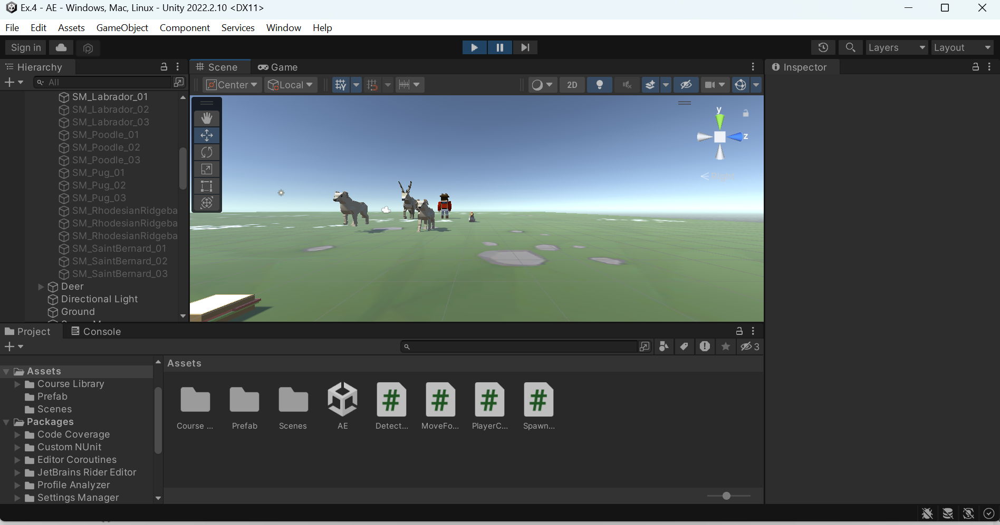

# ANIMAL FEEDING PHASE-II
## AIM:
To develop a animal feeding game-Phase-2 using unity engine with C#.

## ALGORITHM:
### RANDOM ANIMAL STAMPEDE:
### STEP 1:
In the Hierarchy, create an Empty object called “SpawnManager”.
### STEP 2:
Create a new script called “SpawnManager”, drag the script and attach it to the Spawn Manager in the hierarchy , and open it.
### STEP 3:
Declare new public GameObject[ ] animalPrefabs;
### STEP 4:
In the inspector assign the size as 3 , for each element drag the animals from prefabs folder into the array.

### COLLISION DECISIONS:
### STEP 1:
Double-click on one of the animal prefabs, then Add Component > Box Collider.
### STEP 2:
Click Edit Collider, then drag the collider handles to encompass the object.
### STEP 3:
Check the “Is Trigger” checkbox.
### STEP 4:
Repeat this process for each of the animals and the projectile.
### STEP 5:
Add a RigidBody component to the (pizza)projectile and uncheck “use gravity”.
### STEP 6:
Create a new DetectCollisions.cs script, then drag the scripts and add it to each animal prefab and pizza, then open it and check it.
### STEP 7:
For all the animal prefabs and food in th inspector (below the  layer ) drop down the override option and choose apply all.

## PROGRAM:
### SPAWN MANAGER
```
using System.Collections;
using System.Collections.Generic;
using UnityEngine;

public class SpawnManager : MonoBehaviour
{
    public GameObject[] animalPrefabs;
    public float spawnRangeX = 20;
    public float spawnPosZ = 20;
    public float startDelay = 2;
    public float spawnInterval = 1.5f;
    // Start is called before the first frame update
    void Start()
    {
        InvokeRepeating("SpawnRandomAnimal", startDelay, spawnInterval);

    }
    // Update is called once per frame
    void Update()
    {
        if (Input.GetKeyDown(KeyCode.S))
        {
            SpawnRandomAnimal();
        }
    }
    void SpawnRandomAnimal()
    {
        int animalIndex = Random.Range(0, animalPrefabs.Length);
        Vector3 spawnPos = new Vector3(Random.Range(-spawnRangeX, spawnRangeX), 0, spawnPosZ);
        Instantiate(animalPrefabs[animalIndex], spawnPos, animalPrefabs[animalIndex].transform.rotation);
    }
}
```

### DETECT COLLIDER
```
using System.Collections;
using System.Collections.Generic;
using UnityEngine;

public class DetectCollider : MonoBehaviour
{
    // Start is called before the first frame update
    void Start()
    {

    }

    // Update is called once per frame
    void Update()
    {

    }
    private void OnTriggerEnter(Collider other)
    {
        Destroy(gameObject);
        Destroy(other.gameObject);
    }
}
```

## OUTPUT:


## RESULT:
Thus,the Animal feeding game-Phase-2 using unity engine is developed successfully.

